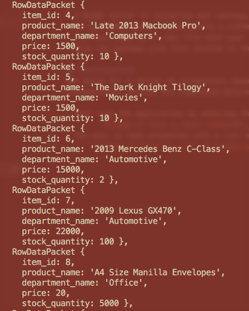
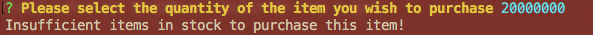
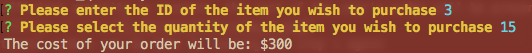

# MySQL Storefront

## Introduction
The following app uses a MySQL backend to store various items, and features a Node based CLI for interacting with the 
database and placing orders. 

## Prerequisites

- A MySQL server is installed and running, and the machine you will be running bamazonCustomer.js on has access to it
- On the MySQL server there exists a schema in line with the schema defined in storefrontSeed.sql
- You have supplied a .env file with your MySQL access credentials
- With the package.json file located in the same directory as bamazonCustomer.js, you have run "npm install"

## Functionality
See below for a series of screenshots demonstrating app functionality. Please be sure that all items in the 
prerequisites section are completed before attempting.

- User runs the application by entering the command "node bamazonCustomer.js"
    -   
- The user is then presented with a list of items currently in the database
    - 
    - Note that at this stage in development it is a known bug that the UI will not continue until the user presses 
      any key after the list is displayed. Simply press any key to continue at this juncture.
- The user is then prompted to enter the ID of the item they wish to purchase
    - 
- The user is then prompted for a quantity of items to purchase
    - 
- In the event that there is insufficient quantity to fulfill the user's request, an error message will be displayed
    - 
- If sufficient quantity is present, the cost of the user's order will be presented to them
    - 
- Additional orders can be made by running the step 1 again